# Evidence - GitOps, SLO, alert email, canary auto-abort

This evidence shows that the `api` release is managed through GitOps, measured by Prometheus, protected by an SLO alert, and controlled by Argo Rollouts analysis.

## 1. ArgoCD overview

All main components are managed through GitOps by the root app-of-apps:

- `root`
- `api`
- `kube-prometheus-stack`
- `argo-rollouts`
- `web`
- `fullstack-demo`

Evidence command:

```powershell
kubectl -n argocd get applications
```

Expected signal:

- `root` is present.
- `api` is present.
- `kube-prometheus-stack` is present.
- `argo-rollouts` is present.

Screenshot to capture:

- ArgoCD UI root application tree.
- Terminal output of `kubectl -n argocd get applications`.

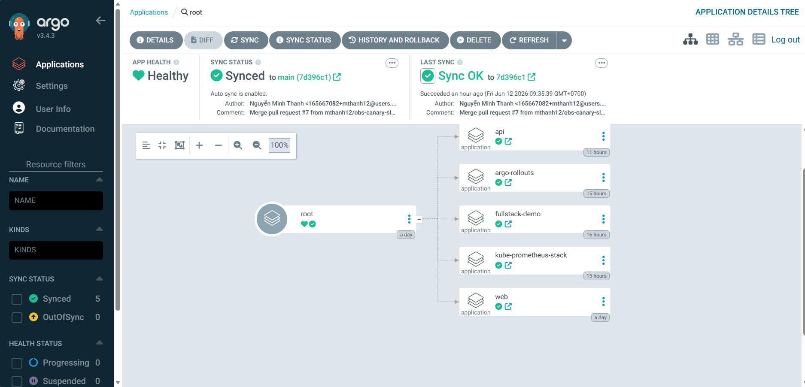

## 2. API application running inside the cluster

The `api` application runs in namespace `demo` and exposes HTTP metrics on port `8080`.

Evidence commands:

```powershell
kubectl -n demo get svc api
kubectl -n demo get pod -l app=api
kubectl -n demo port-forward svc/api 8089:8080
```

In another PowerShell window:

```powershell
1..10 | ForEach-Object { curl.exe -s http://127.0.0.1:8089/ }
curl.exe -s http://127.0.0.1:8089/metrics
```

Expected signal:

- Service `api` exists.
- Pods with label `app=api` are running.
- HTTP response shows `version`.
- `/metrics` exposes `flask_http_request_total`.

Evidence:

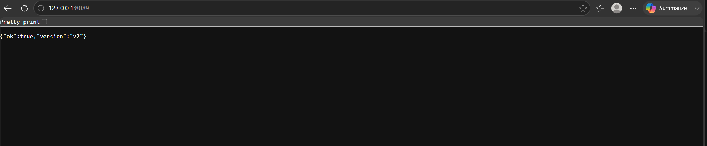

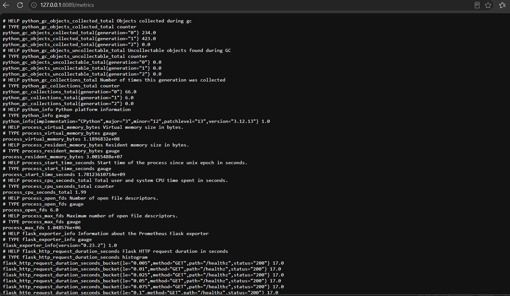

## 3. Metrics and SLO in Prometheus

Prometheus scrapes the `api` ServiceMonitor and evaluates the SLO rule.

Evidence commands:

```powershell
kubectl -n demo get servicemonitor api
kubectl -n demo get prometheusrule api-slo
kubectl -n demo describe prometheusrule api-slo
```

Prometheus UI commands:

```powershell
kubectl -n monitoring get pod prometheus-kube-prometheus-stack-prometheus-0
kubectl -n monitoring port-forward pod/prometheus-kube-prometheus-stack-prometheus-0 9090:9090
```

Prometheus queries:

```text
flask_http_request_total{namespace="demo"}
flask_http_request_total{namespace="demo",status=~"5.."}
```

Expected signal:

- `ServiceMonitor api` exists.
- `PrometheusRule api-slo` exists.
- Metric `flask_http_request_total` is visible.
- 5xx metric appears when error injection is running.

Evidence:

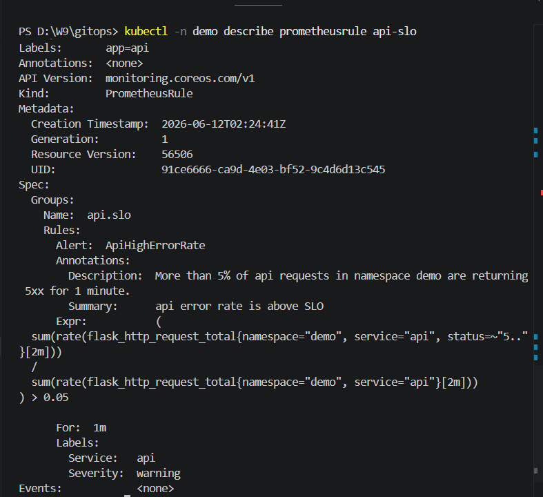

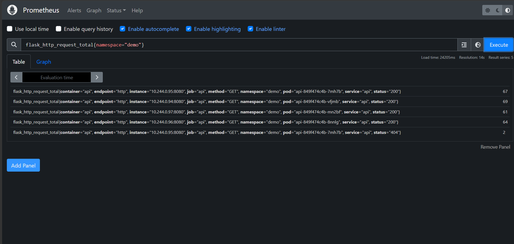

Note: if Prometheus UI cannot open because the pod is restarting, use the Kubernetes evidence and Alertmanager email evidence below.

## 4. Good release / canary analysis

The canary rollout uses `AnalysisTemplate api-success-rate` to decide whether the release can continue.

Evidence commands:

```powershell
kubectl -n demo get rollout api
kubectl -n demo describe rollout api
kubectl -n demo get analysisrun
kubectl -n demo describe analysistemplate api-success-rate
```

Expected signal:

- Rollout `api` has canary steps.
- Steps include `analysis` with template `api-success-rate`.
- Successful AnalysisRun exists for a healthy version.

Evidence:

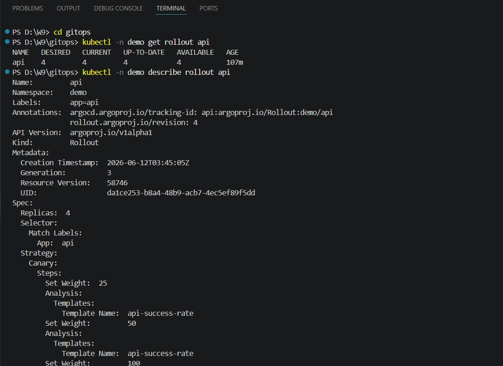

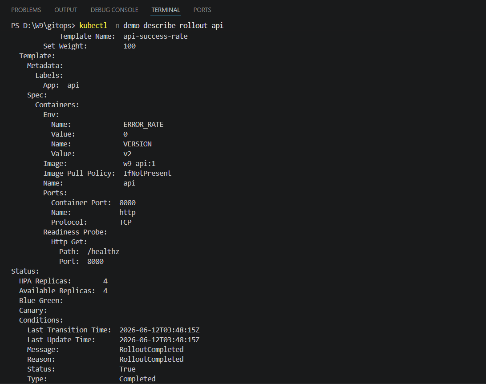

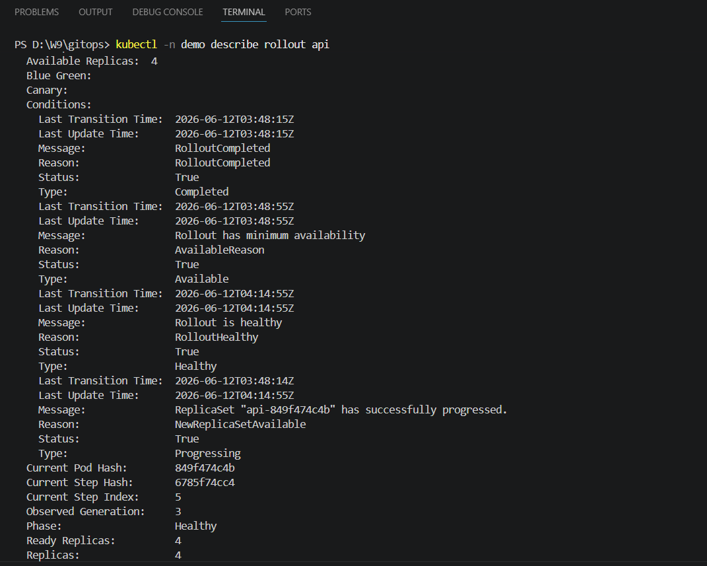

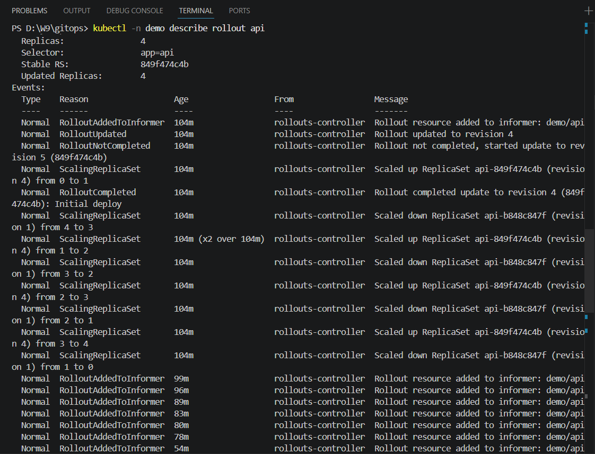

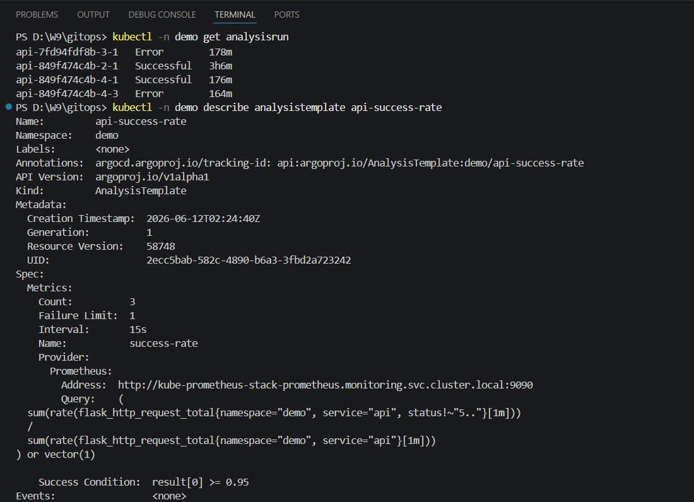

## 5. Alert delivery to personal email

Alertmanager is configured to route alerts to the personal Gmail inbox through Secret `alertmanager-email-config`.

Evidence commands:

```powershell
kubectl -n monitoring get secret alertmanager-email-config
kubectl -n monitoring get alertmanager kube-prometheus-stack-alertmanager -o jsonpath="{.spec.configSecret}{' '}{.status.conditions[?(@.type=='Reconciled')].status}{' '}{.status.availableReplicas}"
kubectl -n monitoring logs alertmanager-kube-prometheus-stack-alertmanager-0 -c alertmanager --tail=200 | Select-String "personal-email|Notify success|Notify attempt failed|ApiHighErrorRate|Watchdog"
```

Expected signal:

- Secret `alertmanager-email-config` exists.
- Alertmanager `configSecret` is `alertmanager-email-config`.
- Alertmanager log contains `receiver=personal-email`.
- Alertmanager log contains `Notify success`.
- Gmail inbox receives alert email.

Current evidence from the lab:

- Gmail received Alertmanager emails, including `TargetDown` firing/resolved alerts.
- Alertmanager log showed `Notify success`.

This proves:

```text
Prometheus / Alertmanager -> Gmail SMTP -> personal inbox
```

Evidence:

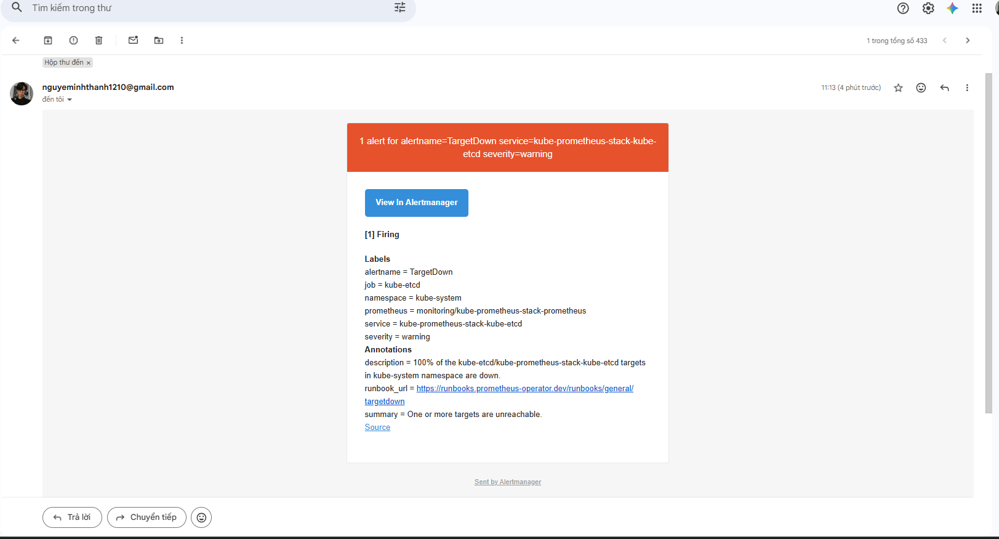

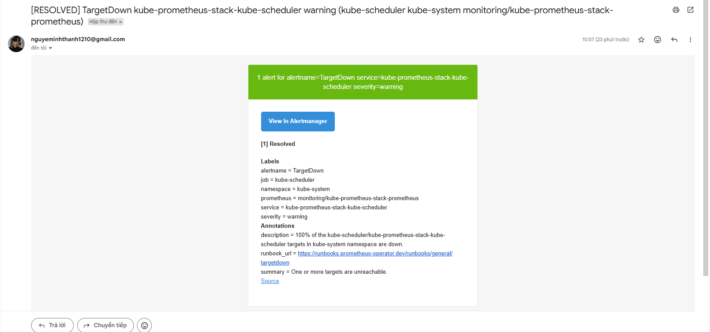

## 6. Error injection and SLO alert

The bad API pod injects HTTP 500 responses so Prometheus can detect error-rate degradation.

Evidence commands:

```powershell
kubectl -n demo get pod api-alert-test
kubectl -n demo get endpoints api-alert-test
kubectl -n demo logs api-alert-test --tail=80
```

Expected signal:

- `api-alert-test` is running.
- `api-alert-test` log contains `GET / HTTP/1.1 500`.
- The temporary service `api-alert-test` has an endpoint.

Prometheus rule verification:

```text
http://localhost:9090/alerts
```

Look for the rule:

```text
ApiHighErrorRate
```

Current evidence from the lab:

- `api-alert-test` is running.
- `api-alert-test` endpoint exists.
- `api-alert-test` logs show repeated HTTP `500`.
- Prometheus has loaded rule `ApiHighErrorRate`, but the screenshot shows it as `Inactive`.

Important note:

The current `api-alert-test` pod proves error injection, but it is a temporary service separate from the real `api` service. Therefore it does not necessarily trigger the `ApiHighErrorRate` rule, because the SLO rule queries `service="api"`.

To prove `ApiHighErrorRate` firing, inject errors into the real Rollout/Service `api` through Git or temporarily patch the real Rollout so Prometheus sees 5xx metrics on `service="api"`.

Evidence:

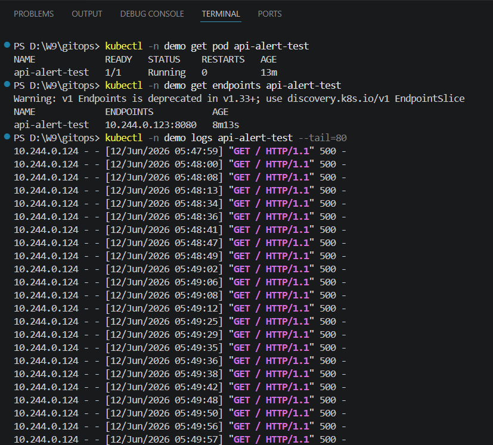

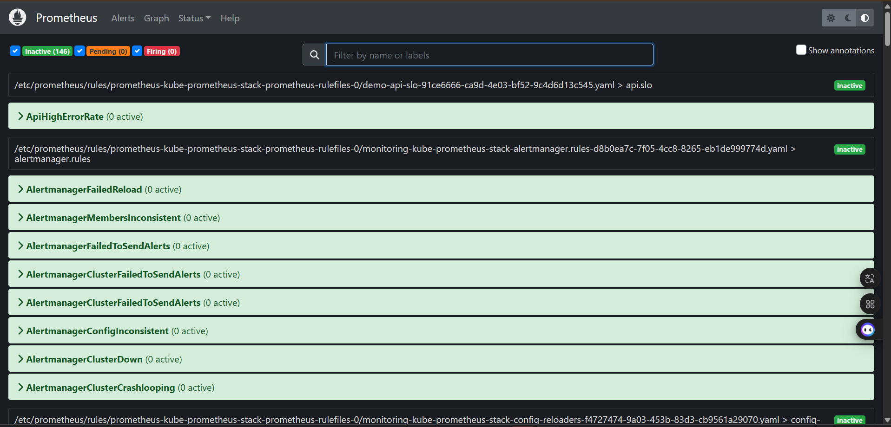

## 7. Rollout abort evidence

The bad canary is blocked by AnalysisRun and the stable ReplicaSet is kept in place.

Evidence commands:

```powershell
kubectl -n demo get rollout api
kubectl -n demo get analysisrun
kubectl -n demo describe rollout api
kubectl -n demo get rs,pod -l app=api
```

Expected signal:

- At least one AnalysisRun has status `Error`.
- Bad ReplicaSet has `DESIRED 0` after abort/failure.
- Stable ReplicaSet remains running.

Current evidence from the lab:

- `api-7fd94fdf8b-3-1` had status `Error`.
- Bad ReplicaSet `api-7fd94fdf8b` was scaled down to `0`.
- Current stable ReplicaSet `api-849f474c4b` kept serving.

Evidence:

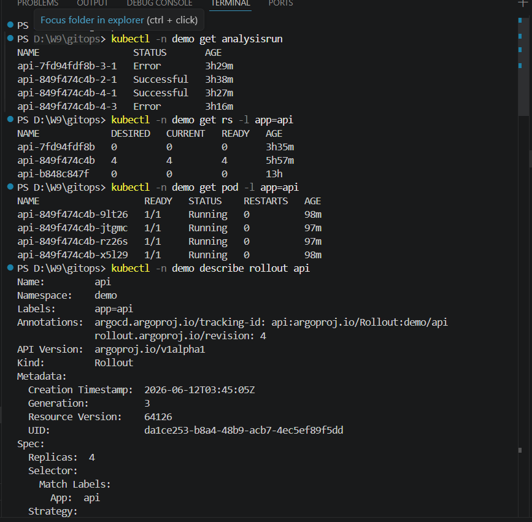

## 8. Release state

The release state can be checked from Kubernetes without relying on Prometheus UI.

Evidence command:

```powershell
kubectl -n demo get rollout,analysisrun,rs,pod,svc,prometheusrule,servicemonitor
```

Expected signal:

- `rollout/api` exists.
- `analysisrun` objects show successful and failed analyses.
- `prometheusrule/api-slo` exists.
- `servicemonitor/api` exists.
- API pods are running.

## Demo script

Use this sequence when presenting:

```powershell
kubectl -n argocd get applications
kubectl -n monitoring get pods
kubectl -n monitoring get secret alertmanager-email-config
kubectl -n monitoring get alertmanager kube-prometheus-stack-alertmanager -o jsonpath="{.spec.configSecret}{' '}{.status.conditions[?(@.type=='Reconciled')].status}{' '}{.status.availableReplicas}"
kubectl -n demo get rollout,analysisrun,rs,pod,svc,prometheusrule,servicemonitor
kubectl -n demo describe analysistemplate api-success-rate
kubectl -n demo describe prometheusrule api-slo
kubectl -n demo logs api-alert-test --tail=40
kubectl -n monitoring logs alertmanager-kube-prometheus-stack-alertmanager-0 -c alertmanager --tail=200 | Select-String "personal-email|Notify success|Notify attempt failed|ApiHighErrorRate|Watchdog"
```

Cleanup after evidence capture:

```powershell
kubectl -n demo delete pod api-alert-test load --ignore-not-found
```
